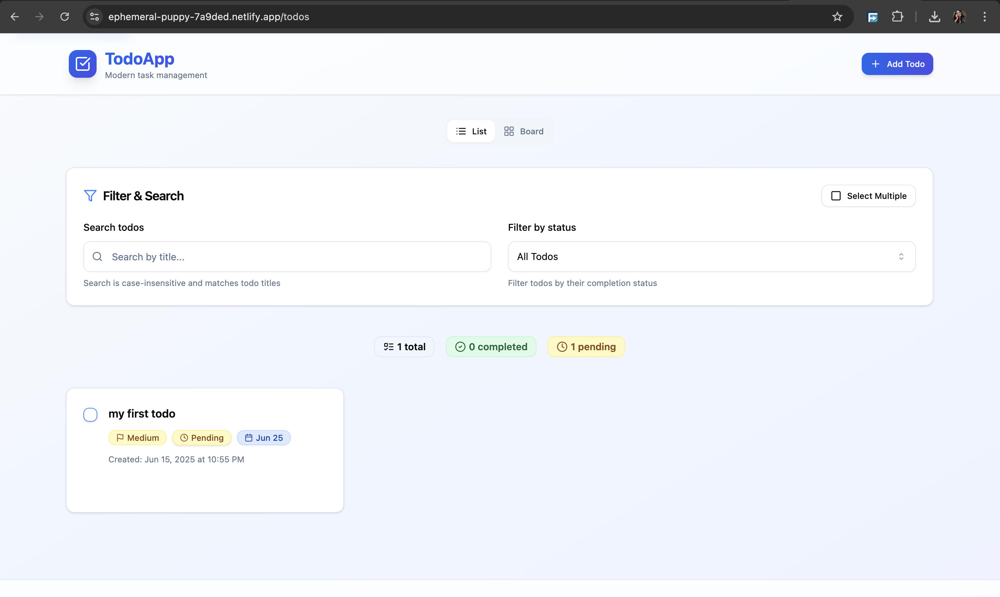
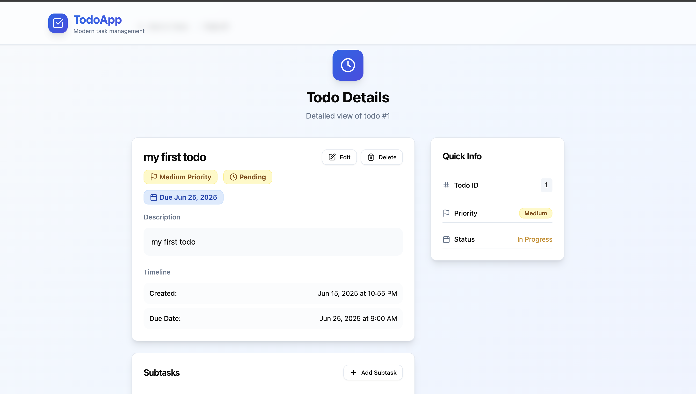
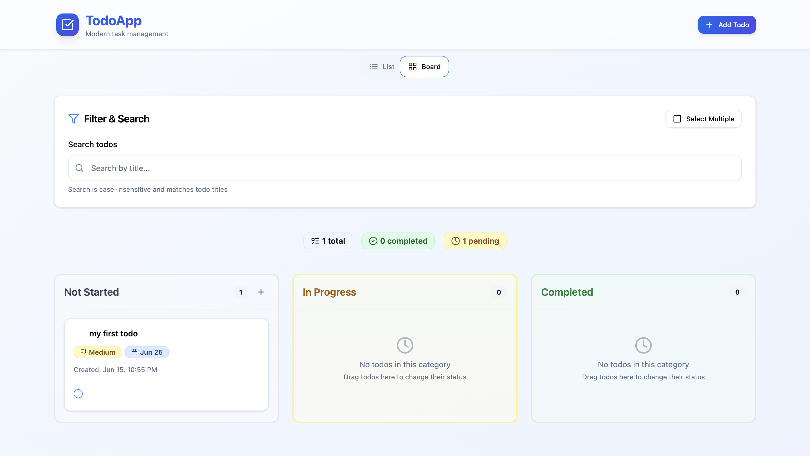
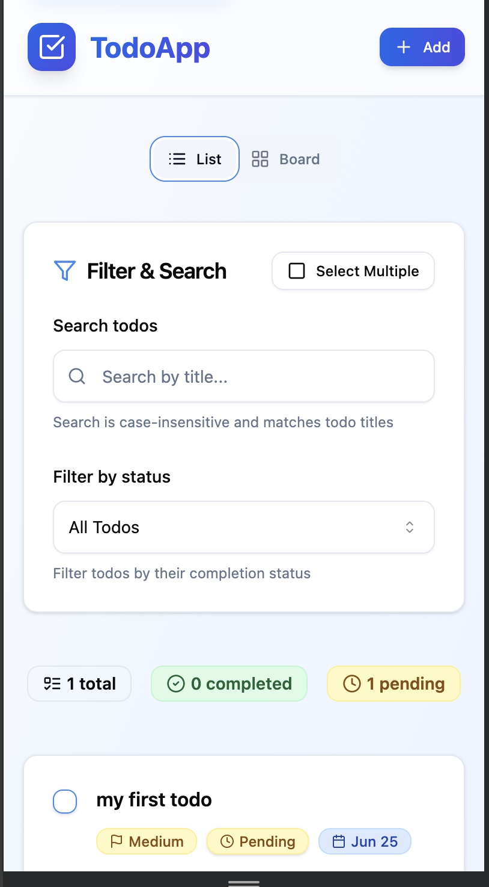

# TodoApp - Modern Task Management

A feature-rich, production-ready todo application built with React, TypeScript, and modern web technologies. This application provides a seamless task management experience with a beautiful UI, robust functionality, and excellent performance.



## 🌟 Features

### Core Functionality
- **Complete CRUD Operations**
  - Create, read, update, and delete todos
  - Bulk operations for multiple todos
  - Real-time updates with optimistic UI
- **Advanced Task Management**
  - Subtasks support
  - Priority levels
  - Due dates and reminders
  - Tags and categories
- **Smart Organization**
  - Client-side pagination
  - Advanced search and filtering
  - Sort by multiple criteria
  - Drag-and-drop reordering

### User Experience
- **Responsive Design**
  - Mobile-first approach
  - Tablet and desktop optimizations
  - Touch-friendly interactions
- **Accessibility**
  - WCAG 2.1 AA compliant
  - Full keyboard navigation
  - Screen reader support
  - High contrast mode
- **Modern UI/UX**
  - Clean, minimalist design
  - Smooth animations
  - Dark/Light mode
  - Customizable themes

### Technical Features
- **Performance**
  - Code splitting
  - Lazy loading
  - Optimized re-renders
  - Efficient state management
- **Data Persistence**
  - LocalStorage integration
  - Offline support
  - Data export/import
- **Security**
  - Input sanitization
  - XSS protection
  - Secure data handling

## 🛠️ Technology Stack

### Frontend
- **React 18+** - Latest React with concurrent features
- **TypeScript** - Type-safe JavaScript development
- **React Router v6** - Client-side routing
- **React Query** - Server state management
- **React Hook Form** - Form handling
- **Zod** - Schema validation
- **Tailwind CSS** - Utility-first CSS
- **shadcn/ui** - UI components
- **Lucide React** - Icons
- **Vite** - Build tool

### Development Tools
- **ESLint** - Code linting
- **Prettier** - Code formatting
- **TypeScript** - Static typing
- **Jest** - Unit testing
- **React Testing Library** - Component testing

## 🚀 Getting Started

### Prerequisites
- Node.js 18+
- npm or yarn
- Git

### Installation

1. **Clone the repository**
   ```bash
   git clone https://github.com/cutebambiii/alt-to-do-main.git
   cd alt-to-do-main
   ```

2. **Install dependencies**
   ```bash
   npm install
   # or
   yarn install
   ```

3. **Start development server**
   ```bash
   npm run dev
   # or
   yarn dev
   ```

4. **Open your browser**
   Navigate to `http://localhost:5173`

### Available Scripts

```bash
# Start development server
npm run dev

# Build for production
npm run build

# Preview production build
npm run preview

# Run tests
npm run test

# Run linting
npm run lint

# Format code
npm run format
```

## 📁 Project Structure

```
src/
├── components/          # Reusable UI components
│   ├── ui/             # shadcn/ui components
│   └── ErrorBoundary.tsx
├── features/
│   └── todos/          # Todo feature module
│       ├── components/ # Todo-specific components
│       ├── hooks/      # Custom React hooks
│       ├── pages/      # Todo pages/views
│       └── types.ts    # TypeScript types
├── layout/             # Layout components
├── lib/                # Utility functions
├── pages/              # General pages
├── router/             # Routing configuration
└── App.tsx            # Main application component
```

## �� Configuration

### LocalStorage Configuration
The app uses LocalStorage for data persistence. Configure the storage key in `src/lib/localStorage.ts`:
```typescript
export const TODOS_STORAGE_KEY = 'todos';
```

## 📱 Screenshots

### Todo List View

- Clean, card-based layout
- Search and filter controls
- Pagination
- Quick actions

### Todo Detail View

- Comprehensive todo information
- Progress visualization
- Inline editing
- Breadcrumb navigation

### Mobile Experience

- Responsive design
- Touch-optimized
- Accessible navigation

## 🐛 Known Issues

1. **LocalStorage Limitations**
   - Browser storage limits (5-10MB)
   - No cross-device synchronization
   - Data loss on browser data clearing

2. **Performance**
   - Large lists may cause slight lag
   - Initial load time with many todos
   - Memory usage with extensive data

3. **Browser Compatibility**
   - Limited support for older browsers
   - Some features require modern browsers
   - Offline functionality varies by browser

## 🔮 Future Improvements

1. **Features**
   - [ ] Cloud synchronization
   - [ ] User authentication
   - [ ] Collaborative editing
   - [ ] Calendar integration
   - [ ] Email notifications

2. **Technical**
   - [ ] PWA support
   - [ ] Service worker implementation
   - [ ] IndexedDB for larger storage
   - [ ] WebSocket for real-time updates
   - [ ] Unit test coverage

3. **UI/UX**
   - [ ] Custom themes
   - [ ] Advanced animations
   - [ ] Gesture controls
   - [ ] Voice commands
   - [ ] Accessibility improvements

## 🤝 Contributing

We welcome contributions! Please follow these steps:

1. Fork the repository
2. Create a feature branch
3. Commit your changes
4. Push to the branch
5. Create a Pull Request

### Development Guidelines
- Follow TypeScript best practices
- Maintain accessibility standards
- Write semantic HTML
- Keep components small and focused
- Use meaningful commit messages

## 📄 License

This project is licensed under the MIT License - see the [LICENSE](LICENSE) file for details.

## 🙏 Acknowledgments

- **shadcn/ui** for the beautiful component library
- **Lucide** for the icon set
- **Vercel** for the deployment platform
- All contributors and supporters

## 📞 Support

For support, please:
- Open an issue
- Check the documentation
- Join our community
- Contact the maintainers

---

Made with ❤️ by Cutebambii